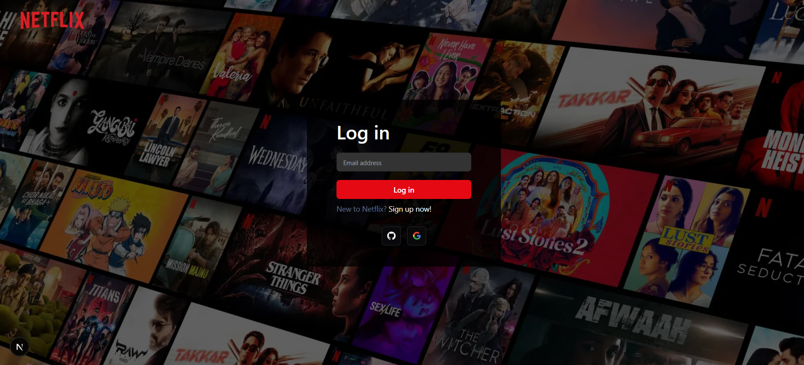
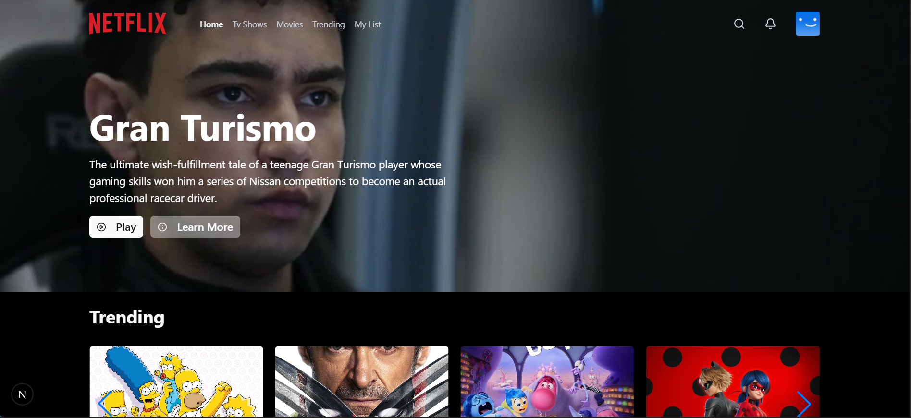
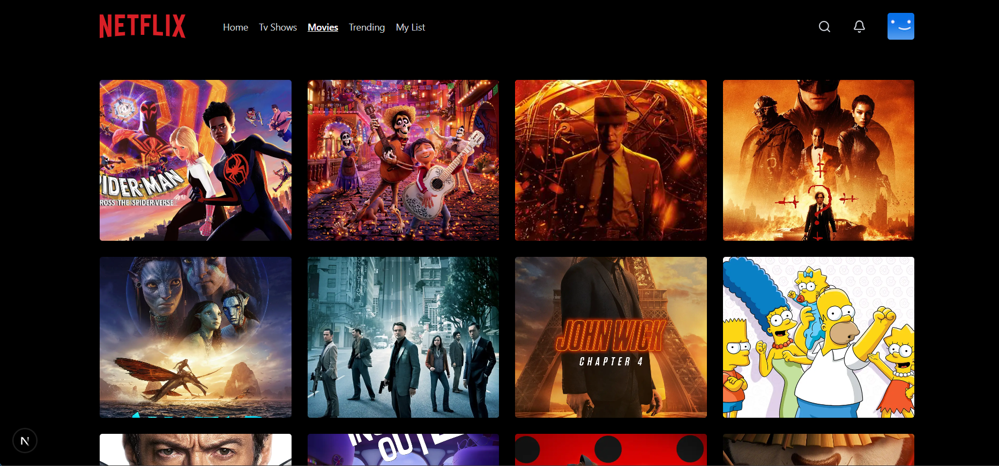

# 🎬 Netflix Clone — Next.js 15 + Supabase + Prisma + NextAuth + Tailwind + ShadCN/UI

A *modern Netflix-like streaming web app* built using *Next.js 15*, featuring authentication, database management, and a sleek responsive UI.  
This project demonstrates how to build a *production-grade full-stack web application* using the latest web technologies.

<p align="center"></p>

---

## 🚀 Tech Stack

| Technology             | Description                                  |
| ---------------------- | -------------------------------------------- |
| ⚡ *Next.js 15*       | App Router, SSR, and API Routes              |
| 🔐 *NextAuth.js*     | Secure authentication & session management   |
| 🗄 *Supabase*       | PostgreSQL database, auth & file storage     |
| 💾 *Prisma ORM*      | Elegant database schema, migrations, seeding |
| 🎨 *Tailwind CSS v4* | Utility-first responsive styling             |
| 🧩 *ShadCN/UI*       | Pre-built modern UI components               |
| 🧠 *Framer Motion*   | Subtle animations and smooth transitions     |

---

## 🖼 Preview

### 🔐 Authentication  


### 🌆 Home Page  


### 🎥 Movie Details  



---

# ⚙ Features

✅ Modern Netflix-style UI

✅ Secure Authentication with NextAuth

✅ Login via Google & GitHub

✅ Browse Trending & Recently Added Movies

✅ Play Movie Trailers with Modals

✅ Movie Search

✅ Genre-Based Movie Filtering

✅ Supabase + Prisma integration for data storage

✅ Responsive & Animated Design (Tailwind + Shadcn)

---

# 🛠 Setup & Installation

## 1️⃣ Clone Repository:

git clone https://github.com/Mohtady154/Netflix-Clone.git

cd netflix-clone

## 2️⃣ Install Dependencies:

npm install

## 3️⃣ Configure Environment Variables:

Create a .env file in your project root:

DATABASE_URL="your_supabase_database_url"

NEXTAUTH_SECRET="your_generated_secret"

NEXTAUTH_URL="http://localhost:3000"

GITHUB_ID=your github id

GITHUB_SECRET=your github secret code

GOOGLE_CLIENT_ID=your google client id 

GOOGLE_CLIENT_SECRET=your google client secret code 

EMAIL_SERVER_USER=resend

EMAIL_SERVER_PASSWORD=your email server password 

EMAIL_SERVER_HOST=smtp.resend.com

EMAIL_SERVER_PORT=465

EMAIL_FROM=onboarding@resend.dev

NEXTAUTH_DEBUG=true

## 4️⃣ Run Prisma Migrations:

npx prisma migrate dev

## 5️⃣ Start Development Server:

npm run dev

## 👨‍💻 Author

Mohtady Sameh | Software Developer | 📧 mohtadysameh154@gmail.com | 🌐 LinkedIn : https://www.linkedin.com/in/mohtady-sameh-dev/

⭐ Support

If you found this project helpful, consider giving it a ⭐ on GitHub — it motivates a lot!

<p align="center">  </p> ```
